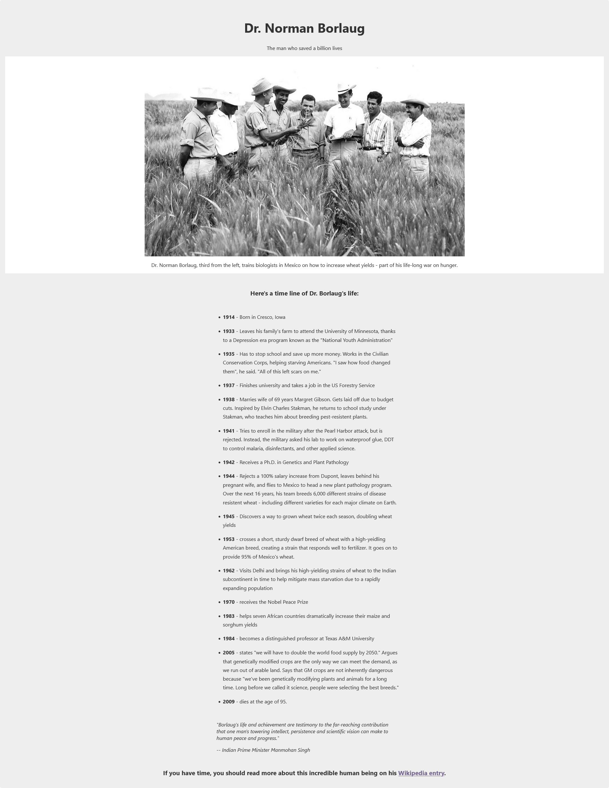

# Tribute Page - freeCodeCamp Responsive Web Design Certification Projects 2/5

This is a solution to the [Tribute Page project for responsive web design certification on freeCodeCamp](https://www.freecodecamp.org/learn/2022/responsive-web-design/).

## Overview

### Screenshot

### Links

- [View Code]()
- [Live Preview]()

## My process

### Built with

- HTML
- CSS

### What I learned

I completed this project locally before I started using git and github, along with other projects on freeCodeCamp for the responsive web design certification. There might be shortcomings on the use of semantic HTML markup and the stylesheet, but I decided to include these projects on my github account as I want to gather all my projects here. These projects are the ones where I started to get real practive with HTML and CSS for the first time. This is the second of five projects.